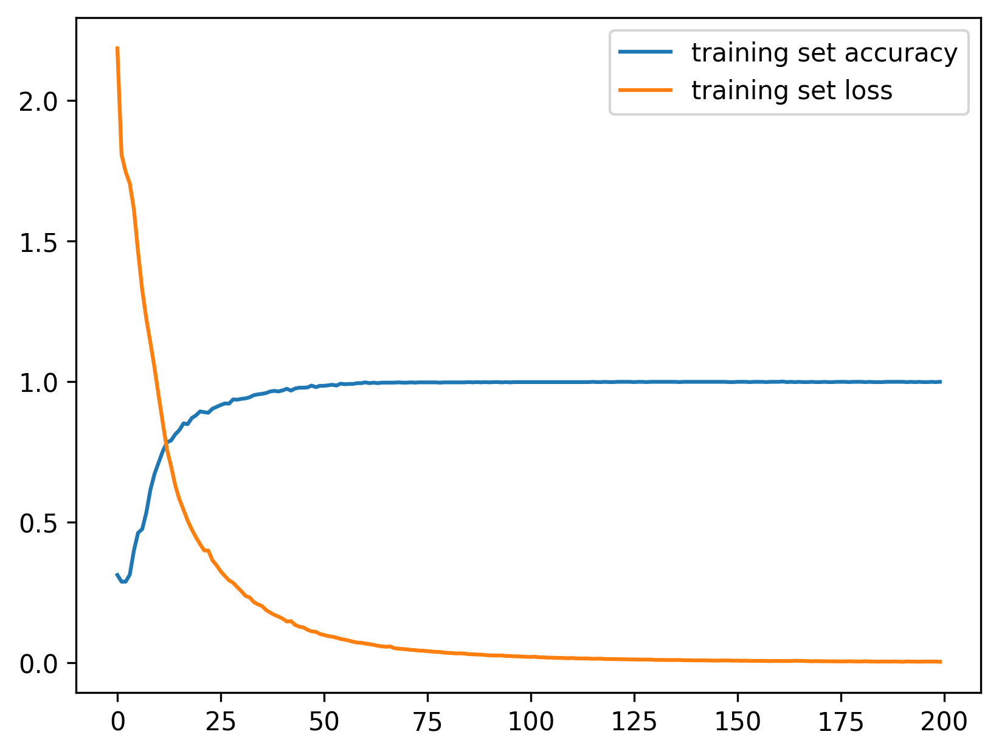

# covid-chatbot

A deep learning based chatbot for COVID-19

## COVID Chatbot Application

The chatbot is available at: [https://huggingface.co/spaces/waleedgeo/covidbot](https://huggingface.co/spaces/waleedgeo/covidbot).

The app was created using [Gradio](https://gradio.app/) and [Hugging Face](https://huggingface.co/spaces).

## Accuracy

The model is trained on the [COVID-19 Open Research Dataset](https://pages.semanticscholar.org/coronavirus-research) and achieves an accuracy of 0.99.

## Model

The model was trained using LSTM model for 200 epochs. The model was trained using the Adam optimizer with a learning rate of 0.001. The model was trained on a GPU (NVEDIA RTX 3070, Compute Unit 8.6). The summary of model is:

---